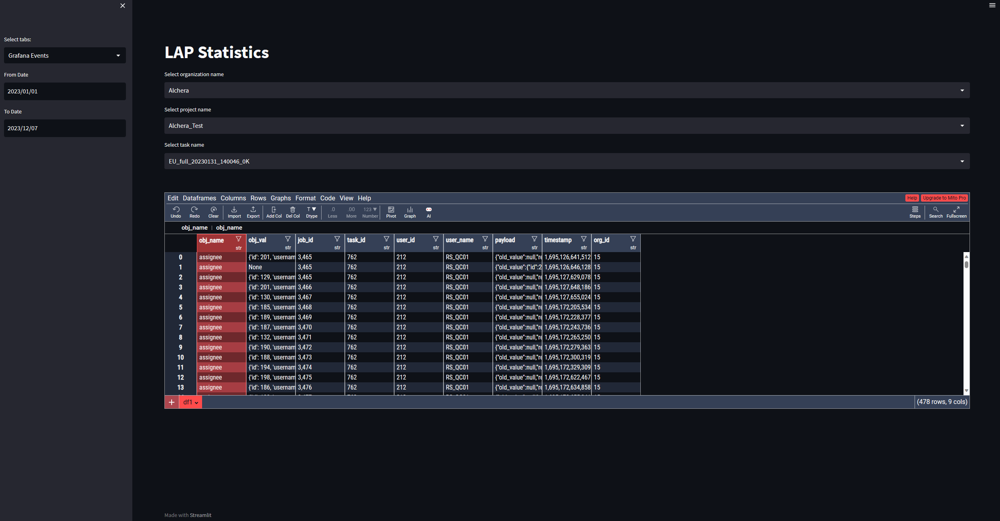

# LAP_Stat
A simple interface to view statistics from LAP APIs and Grafana

- [stat_lap.py](stat_lap.py): Utility functions to export statistics
- [streamlit_app.py](streamlit_app.py): Streamlit interface 
- [pyproject.toml](pyproject.toml): Dependencies using poetry 

## Interface guide
The interface has two main parts:
- The sidebar on the left side to edit settings
- The main screen to display statistics



### Sidebar features
- Select information tabs between Grafana Events, Job Information or Performance Information
- Choose start date and end date for crawl information
- Choose skip, limit for task filtering (skip is starting index, limit is ending index)
- Sort the tasks order (ascending or descending)

### Main screen
- A select box is at the top to choose which organization and task for display
- The dataframe underneath display information based on settings, and also support exporting files in `csv/excel` format
- `mitosheet` (a python library) also supports extra features such as plotting, graphing, etc.
  
## Installation guide

- ### Using Environment 
Create a python environment
```shell
python -m venv [environment name]
```

After activating the environment, install `poetry` to manage requirements
```shell
pip install poetry
```

Using poetry, we can install requirements with the [pyproject.toml](pyproject.toml) file
```shell
poetry install
```

Run the streamlit website 
```shell
streamlit run streamlit_app.py --server-address [address] --server-port [port]
```

The default site will be at `localhost:8501` if address and port are not set

- ### Using Docker
Build the streamlit app image with Docker
```shell
docker build -t streamlit-app .
```

Run the image 
```shell
docker run -p [port]:8501 streamlit:app
```

Likewise, the site is at `localhost:[port]`